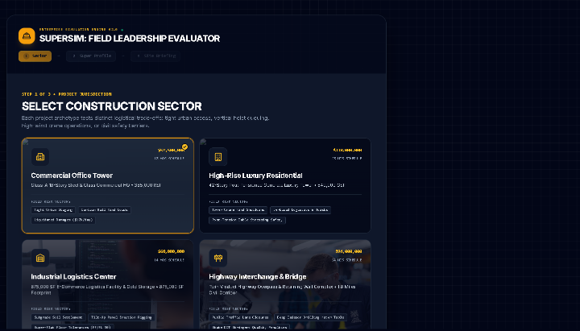
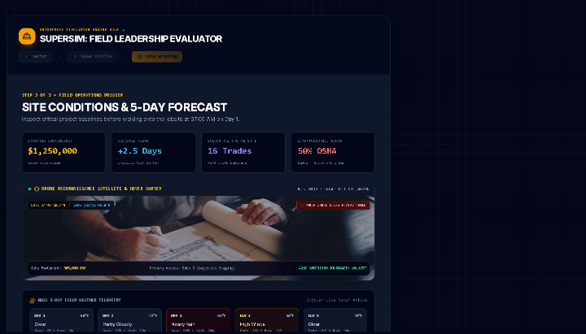
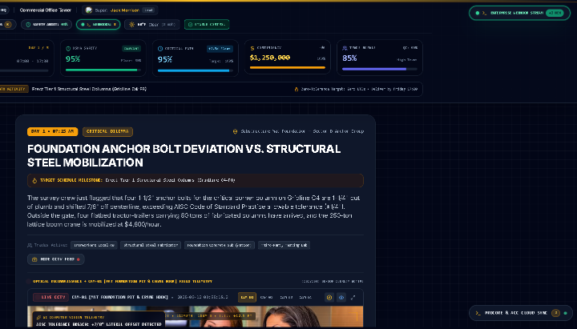

# SuperSim

An AI-powered field leadership simulator: play a 5-day work week as a
construction superintendent — real-time OSHA compliance, trade
coordination, schedule/budget tradeoffs — then get an AI-generated
executive hiring evaluation of how you led. Built as a hiring/training
assessment tool, not a game.



## How it works

1. **Pick a project sector** — Commercial Office Tower, High-Rise
   Residential, Industrial Logistics Center, or Highway Interchange &
   Bridge — each with a different budget, schedule float, trade count, and
   OSHA baseline.
2. **Set up your superintendent profile** — name, experience tier, and a
   field risk-tolerance stance (conservative / balanced / aggressive) that
   flavors how scenarios and AI feedback read.
3. **Review site conditions** — starting contingency, schedule float, trade
   count, and a 5-day weather forecast before Day 1 begins.



4. **Work the 5-day week** — each day presents a live "Iron Triangle" HUD
   (Safety / Schedule / Budget / Trade Morale, all tracked as running
   percentages) and a critical-path dilemma with real trade-specific detail
   (AISC tolerance breaches, crane mobilization costs, weather-driven pour
   windows). Respond with a standard tactical order, or **record a freeform
   radio directive** in your own words — Gemini evaluates it against OSHA
   compliance, spec rigor, subcontractor buy-in, and cost liability, with a
   realistic "lead foreman" radio-chatter response.
5. **Get evaluated** — a post-mortem executive report classifies you (Hire
   Senior Lead / Hire Project Super / Conditional Training / Do Not Hire),
   scores each Iron Triangle pillar, and writes up your "Field Leadership
   DNA" — all backed by a full decision chronicle.



## AI integration pattern

Every Gemini call — scenario enrichment, site-artifact generation
(RFI/NCR/Daily Log), freeform radio directive evaluation, and the final
executive evaluation — is server-side only (`server.ts`'s `/api/*`
routes), and **every one has a full deterministic fallback** — realistic
rubric-driven scoring and report generation that runs with no AI at all.
Gemini enriches the experience; it's never a hard dependency, and a missing
key or a failed call degrades to the deterministic engine silently rather
than breaking the simulation.

## Stack

React 19 + TypeScript + Vite, Tailwind CSS v4, Express 5 (`server.ts`
serves both the Vite app and the `/api/*` proxy routes), `@google/genai`
for the AI calls, `recharts` for the evaluation dashboard. No database —
state lives in the session; the setup wizard can optionally capture a
webcam photo as a field-avatar badge (never uploaded anywhere, drawn
straight to a canvas client-side).

## Getting started

```bash
npm install
cp .env.example .env   # optionally add GEMINI_API_KEY for real AI scoring
npm run dev
```

Open <http://localhost:3000>. Without `GEMINI_API_KEY`, the deterministic
evaluation engine runs the whole simulation end to end — scenarios, radio
directive grading, and the executive report all still work.

## Commands

| Command | Does |
|---|---|
| `npm run dev` | Start the dev server (Express + Vite middleware) |
| `npm run build` | Production build (Vite client bundle + bundled Express server) |
| `npm run start` | Run the production build |
| `npm run preview` | Preview the Vite build directly |
| `npm run lint` | `tsc --noEmit` |

## License

MIT — see [`LICENSE`](./LICENSE).
